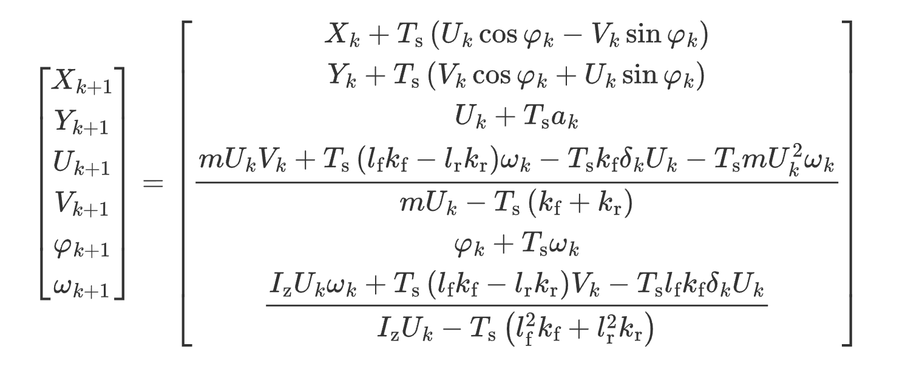
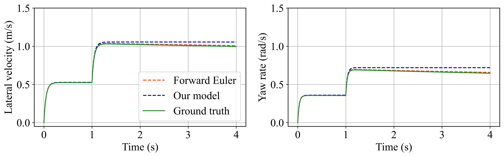
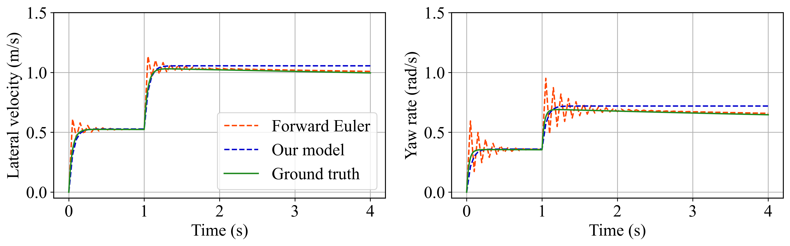
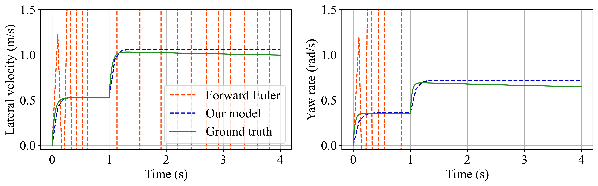

# [Vehicle System Dynamics] An Explicit Discrete-Time Dynamic Vehicle Model with Assured Numerical Stability

## Method
Let vehicle dynamical state be $[X, Y, U, V, \varphi, \omega]$, discrete time step be $T_s$, the formulation of our dynamic vehicle model is



## Simulation
We conduct an open-loop test (`open_loop_test.py`) 
- **Control input**: A two-stage step steering.
- **Baseline**: The existing dynamic vehicle model, discretized via the Forward Euler method, serves as the baseline for comparison. 
- **Ground truth**: To provide a reliable reference without relying on complex software like Carsim, we utilized a Simulink model employing the ODE45 solver to generate the ground truth trajectory.
- **Results**: The simulation results with varying discrete time steps (1ms, 50ms, and 100ms) are presented below.

##### Time step = 1 ms

##### Time step = 50 ms

##### Time step = 100 ms


## Bibtex citation
If you find our work useful, please cite our paper:
```text
@article{zhan2024explicit,
  title={An explicit discrete-time dynamic vehicle model with assured numerical stability},
  author={Zhan, Guojian and Ge, Qiang and Gao, Haoyu and Yin, Yuming and Zhao, Bin and Eben Li, Shengbo},
  journal={Vehicle System Dynamics},
  pages={1--24},
  year={2024},
  publisher={Taylor \& Francis}
}
```